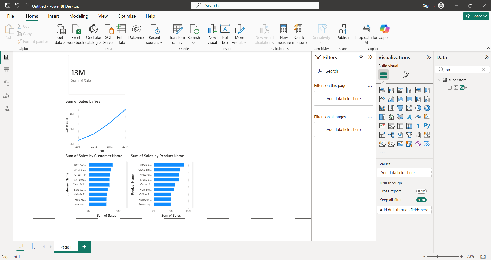

# 📊 Sales Data Analysis Project

## 📌 Overview
This project is an end-to-end data analysis project that analyzes sales data to extract business insights using SQL, Python, and Power BI.

---

## 🛠️ Tools Used
- SQL for data extraction and analysis
- Python for data cleaning and processing
- Power BI for data visualization and dashboard creation

---

## 📂 Project Files
- sales.csv → Dataset used for analysis
- analysis.py → Python code for data processing
- queries.sql → SQL queries for analysis
- dashboard.png → Power BI dashboard screenshot

---

## 📊 Key Insights
- Top-performing products
- Sales trends over time
- Customer purchasing behavior

---

## 📸 Dashboard Preview

---

## 🚀 Author
Abdulaziz Alamri
